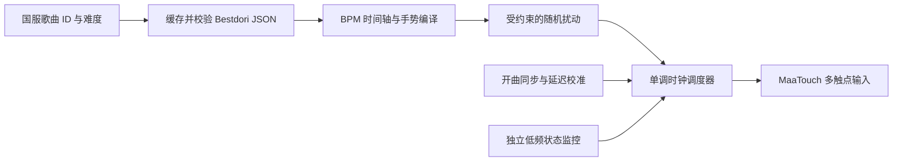

# Bestdori 谱面驱动演出：可行性研究

研究日期：2026-09-19。对象：MaaBanG 中国服、Windows、MuMu、MaaFramework 5.12.2。

> 后续进展：同日第二阶段已经通过快速截图和多帧首键拟合，完成 SAVIOR OF SONG / EASY 的 0 火、关闭内置自动、零抖动 ALL PERFECT 实测。复现方法与适用边界见 [同步基线实验](chart_live_probe.md)。下文保留第一阶段调查及其当时的验证边界，不能把第一阶段“尚未通关”误读为当前最新结果。

## 结论与验证边界

**具备实现基础，建议先做独立实验功能；目前不能宣称已实现稳定自动打歌。** Bestdori 提供结构化谱面，现有 SDK 支持带触点编号的按下、移动和抬起。更合适的路线是“离线谱面编译 + 开曲同步 + 独立定时触控”，而不是逐帧识别后点击。

本次完成了真实谱面获取、四张谱面的结构分析、0 火关闭游戏自动后的开曲采集、两触点 API 通道测量。首轮采集未输入音符，最终演出失败；之后首键视觉锁定实验未成功，未进入完整谱面输入阶段。**没有成功通关数据，也没有实机验证随机抖动后的判定分布。** 未选择星石续关。

现有正式功能和默认选项保持原样。本次研究不把实验播放器挂到清火任务，也不以它替代游戏内自动。测试结束已截图确认返回游戏主页；游戏内选歌/难度/消耗火数保留为本次测试设置（306 / EASY / 0 火），自动演出关闭。

## 1. 谱面来源与真实格式

入口是 [Bestdori 谱面模拟器](https://bestdori.com/tool/chartsimulator)。本次直接读取其站点公开 JSON：

- [歌曲 1 EXPERT](https://bestdori.com/api/charts/1/expert.json)
- [歌曲 1 SPECIAL](https://bestdori.com/api/charts/1/special.json)
- [SAVIOR OF SONG / 306 EASY](https://bestdori.com/api/charts/306/easy.json)
- [SAVIOR OF SONG / 306 EXPERT](https://bestdori.com/api/charts/306/expert.json)

路径形式为 `https://bestdori.com/api/charts/{song_id}/{difficulty}.json`，难度使用小写名称。首次无请求头访问返回 403；加普通 User-Agent 和该模拟器页 Referer 后成功。应处理超时、非 JSON 响应、限流和端点变化；开演前下载并缓存，不在曲中联网。

样本含以下对象：

| 对象 | 实测字段 | 输入含义 |
| --- | --- | --- |
| BPM | `beat`, `bpm` | 节拍到时间的转换依据 |
| System | `beat`, `data` | 系统事件；不是点击音符，也不能全部当作无用数据 |
| Single | `beat`, `lane`，可选 `flick` / `skill` | 单击或滑键；skill 标记本身不产生额外触点 |
| Long | `connections` | 从首点按下到尾点释放；部分尾点有 flick |
| Slide | `connections` | 同一触点保持按下并沿路径移动，可能以 flick 收尾 |

实测轨道编号为 **0–6**。不要把 Long 漏掉，也不要把一个 connections 数组当成互相独立的点击。上述只是四张谱面的实测格式；新字段、方向滑键、隐藏连接点、变速和其他谱型仍需单独验证。未知类型应在开演前拒绝执行，避免静默漏键。

| 谱面 | 音符对象 Single / Long / Slide | 判定点数¹ | 最短不同拍点间隔 | 最大同拍判定点 | 重叠长条上限 |
| --- | --- | --- | --- | --- | --- |
| 1 EXPERT | 321 / 59 / 5 | 459 | 81.08 ms | 2 | 2 |
| 1 SPECIAL | 616 / 54 / 43 | 832 | 54.05 ms | 2 | 2 |
| 306 EASY | 105 / 14 / 0 | 133 | 312.50 ms | 2 | 2 |
| 306 EXPERT | 494 / 50 / 62 | 772 | 39.06 ms | 2 | 2 |

¹ 此处对连接点计数，排除 hidden；四张样本无 hidden，所得数量与项目现有歌曲目录中的 notes 一致。这只验证统计一致，不证明所有国服版本与该端点完全相同。最大重叠长条也不等于所有谱型所需的最大触点数。

现有 `agent/data/songs_cn.json` 已有歌曲 ID、中国服开放难度和 notes。继续使用这个映射，额外核验谱面哈希、难度、版本及音频起点；同名歌曲不能只按标题匹配。社区自制谱需要单独导入并明确映射，不能当成游戏谱自动执行。

## 2. 现有控制链路的限制

`agent/costume_unlock.py` 的 `tap()` 每次点击后等待 0.9 秒；`agent/auto_live.py` 的 `wait_song()` 每 10 秒观察一次，`verify_start()` 会主动开启游戏自动并检查额度。这些适合菜单导航，不能直接作为音符执行器。

对固定版本上游源码的检查还发现：

- [ControllerAgent.cpp](https://github.com/MaaXYZ/MaaFramework/blob/v5.12.2/source/MaaFramework/Controller/ControllerAgent.cpp)：MaaTouch 的普通 click 会通过按下、等待 **50 ms**、抬起来实现；原子 touch_down / move / up 没有这段固定等待。
- 同一控制器的截图和输入都进入其 action runner；[AsyncRunner.hpp](https://github.com/MaaXYZ/MaaFramework/blob/v5.12.2/source/MaaFramework/Base/AsyncRunner.hpp) 按队列顺序执行。增加 Python 线程并不自动消除这个队列的阻塞。
- [MtouchHelper.cpp](https://github.com/MaaXYZ/MaaFramework/blob/v5.12.2/source/MaaAdbControlUnit/Input/MtouchHelper.cpp)：原子触控的返回值来自写入控制管道；SDK 成功并不等于游戏已经采样或判定成功。
- [MaaTouch 协议](https://github.com/MaaAssistantArknights/MaaTouch) 提供多个触点、移动、释放和提交。若需要把同拍双押放入同一批提交，需要额外验证底层协议及执行器，不能假定两个 SDK 调用天然原子同时发生。

因此，建议优先验证 MaaTouch 原子触控，不使用逐键 `adb shell input tap`、普通 `post_click()`、整条阻塞 swipe 或每个音符一个 Pipeline 节点。触点编号应按活动手势分配并保持到释放，而不是永久按轨道编号绑定。

## 3. 本机测量与实验结果

测试曲：SAVIOR OF SONG / EASY；准备页确认自动演出关闭，火消耗预览 **13 → 13**。演出画面七轨中心在 1280×720 截图中约为 x = 197、345、493、640、788、935、1083，判定线 y ≈ 590。这只是本次布局观测，不能作为所有设备的通用坐标。

| 测量 | 样本数 | 中位耗时 | P95 | 最大值 |
| --- | --- | --- | --- | --- |
| 截图请求到返回，含加载与演出 | 54 | 266.39 ms | 383.78 ms | 418.38 ms |
| 原子触控 SDK 调用到任务完成 | 180 | 0.098 ms | 0.142 ms | 0.227 ms |

截图测量不包含后续 JPEG 写盘和主动等待，也不是传感器/画面的真实曝光时间。触控测量是在退出确认弹窗外的舞台区域，两个 contact 交替 down / move / up，共 30 组，SDK 全部返回成功；**它验证了接口通道，不验证游戏内双押、端到端延迟或长按判定**。

默认截图耗时远大于 306 EXPERT 的 39.06 ms 最短间隔。即使单次输入 API 返回很快，也不能在同一控制器队列里插入几百毫秒的截图。独立图像采集、模拟器更快的截图能力或音频同步需要另做测量；本次没有验证 MuMu 专用截图通道。

首键实验用单帧颜色候选和估计下落速度尝试初始化时间轴，未能可靠锁定，因此没有执行预排音符。该失败只能说明这个粗糙同步原型不可用，不能单凭它断定所有视觉同步方案不可行。一次重试还遇到了额外的“重新开始”确认层；正式实验应使用页面状态机，而不是假设点一下就已重新开曲。

原始截图、帧时间、下载样本、诊断脚本和日志位于本地 `debug/chart_research/`（git 忽略）。摘要另存至 `docs/data/chart_live_research_2026-09-19.json`，包含谱面 SHA-256 和测量边界。实验脚本带特定页面坐标与谱面假设，不是可交付的通用播放器。

## 4. 推荐实现结构

### 时间轴与调度

对变 BPM 谱面分段积分，不能只取第一项 BPM。若各段开始拍点为 bᵢ、速度为 BPMᵢ，则目标拍点 b 的时间是前面完整段的时长之和，加当前段 `(b-bᵢ)×60/BPMᵢ`。同拍 BPM 的优先顺序、缺失初始 BPM、负拍和畸形数据都应明确定义或拒绝。

发送时刻可表示为：

`deadline = anchor + chart_time + calibrated_offset - input_latency + jitter`

anchor 的定义要固定为某一游戏/音频时间基准。曲目偏移、游戏判定设置、采集延迟、输入延迟和人工式扰动分别记录，避免在一个 offset 中反复补偿。**点击“演出开始”的时刻不能直接当成音乐起点**，加载与开场动画可能变化。

使用绝对单调时钟 deadline，禁止不断执行 `sleep(相邻间隔)` 累积漂移。预先编译按下、移动、释放事件并分配 contact；同拍事件成组调度。对迟到事件设置策略：轻微迟到记录误差，严重失步释放触点并停止，不能把过期整段音符瞬间补发。

第一阶段只验证一首 EASY 的可靠起点。可研究独立快速截图的多帧拟合，或音频特征对齐；两者都需要采集时间戳和置信度，不能用未经标定的截图返回时间代替音乐时间。后续用节奏锚点估计缓慢漂移，暂停/恢复必须重新锁定。

### 手势执行

- 单键：down，短暂保持，up；保持时长受同手后续音符间隔约束。
- 双押：共享拍点及大部分时间扰动，测量真实触达的两指偏差。
- Long：按下到尾点保持同一 contact，不把头尾当作两个短按。
- Slide：在连接点之间生成连续位置轨迹；时间先按分段 BPM 转换，再插值。插值和采样频率需在实机验证。
- Flick：生成有方向、距离、速度和释放时机的滑动手势；特别验证尾端 flick，不可简单把尾点改成点击。
- 停止或异常：禁止继续添加事件，清理待执行输入，释放所有活动触点。应用退出、切后台、加载异常、暂停及失步都要有清理路径。

当前 MaaTouch 之外的后端必须先做触点能力检查；不能由方法名存在推断它支持多点触控。首次输入前取得实际截图尺寸，统一框架缩放坐标与设备坐标，另外验证镜像设置和判定线位置。

## 5. 随机抖动：自然变化必须受手势约束

先建立零抖动基线，再逐步加入扰动。随机性只是动作变化模型，不能据此宣称“等同真人”或保证不会被识别为自动化。

建议分四层：

1. **每局偏置**：有界的个人早/晚倾向；保持在测得判定余量内。
2. **缓慢变化**：每只手低频相关的时间偏差，采用有界均值回归过程，避免无界随机游走累积失步。
3. **每音符小误差**：截断正态或类似有界分布，加入相关性，而非每个移动点独立抽取白噪声。
4. **空间与手势差异**：轨道内落点、按压时长、滑动弧线、速度变化；围绕平滑基准路径生成，不制造瞬移。

初始试验配置可取时间标准差 3 ms、绝对上限 8 ms，落点横向 ±4 px、纵向 ±2 px（仅针对本次 1280×720 布局）。这些是原型的**待测起点，不是游戏判定窗口或已验证参数**；完整谱面执行未发生，因此不能将本次实验视为该配置的成功验证。

参数上限应由实测剩余裕量决定，例如：

`允许的抖动上限 ≤ 实测可用判定裕量 - 同步残差 - 输入延迟不确定性 - 调度误差 - 安全余量`

右侧非正时先解决延迟/同步问题。密集音符还要取相邻间隔与触点释放余量的更小值。长条以整条共享偏移为主，保持连接点时间单调和持续接触；双押共享偏移后再添加很小的两手差异。扰动后必须重新检查轨道边界、事件顺序、触点冲突及 flick 速度条件。

每次记录随机种子与参数以便复现。若目标是尽量模拟个人手法，最有用的后续数据是用户自愿录制的实际击键时间、轨迹和判定，而不是凭空放大噪声或故意制造 MISS。

## 6. 接入与验收顺序

建议新增独立的“谱面演出（实验）”，复用选歌、火数设置和结算导航；使用自己的手动模式检查与执行器。不能复用会开启自动的 `verify_start()`，也不能直接沿用按自动额度停止的 `round_stop_reason()`。

1. 离线编译：针对变 BPM、同拍双押、重叠长条、尾 flick、隐藏点、未知类型与接触释放编写有意义的测试；缓存带哈希及来源。
2. 起点校准：0 火、关闭内置自动，重复启动同一 EASY；报告同步误差分布与超时失败，而不是只显示“已启动”。
3. 基线演出：关闭扰动，完成整曲，保存 PERFECT/GREAT/GOOD/BAD/MISS、最大连击、调度迟到分布。SDK 返回成功不能替代结算截图。
4. 多手势：分别验证双押、两条长按重叠、滑条、尾 flick，再上 HARD/EXPERT；加入长曲漂移、卡顿、暂停与紧急停止测试。
5. 抖动对照：使用固定种子做零抖动与多档抖动对照，确认没有事件反转、断长按或触点冲突，再选择默认值。
6. 产品集成：以上通过后才开放实验入口、缓存管理、校准配置与可恢复的失败报告。

工程上的下一优先项是**可靠同步与独立采集通道**，随后是触点生命周期与复杂手势。随机抖动适合最后加入；它不能弥补这两类缺口。
